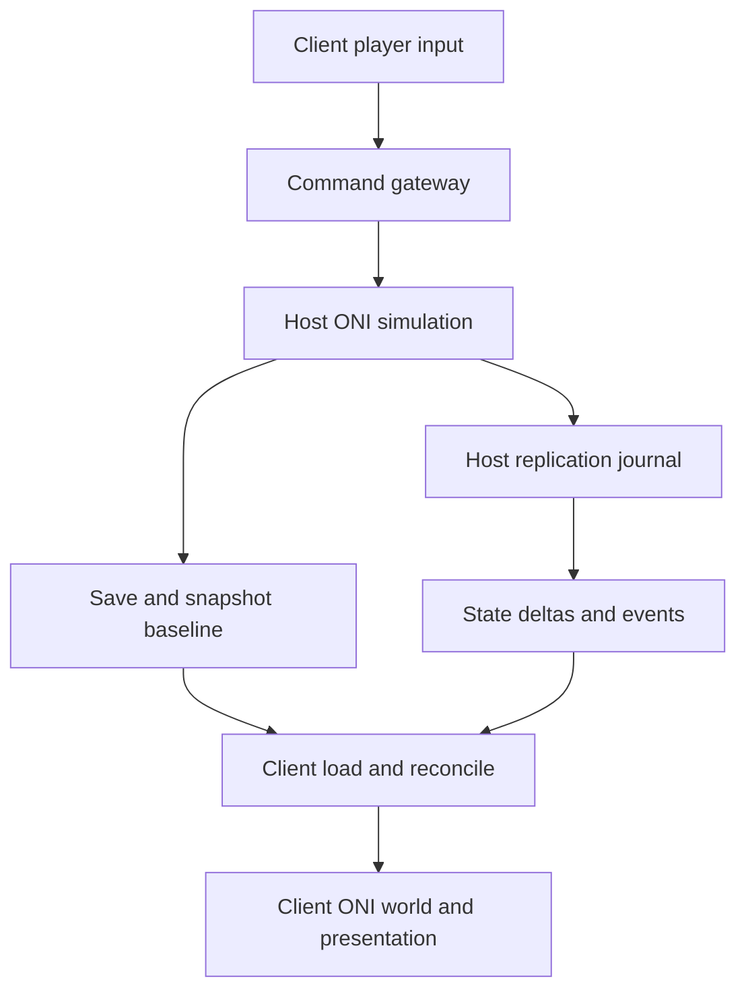
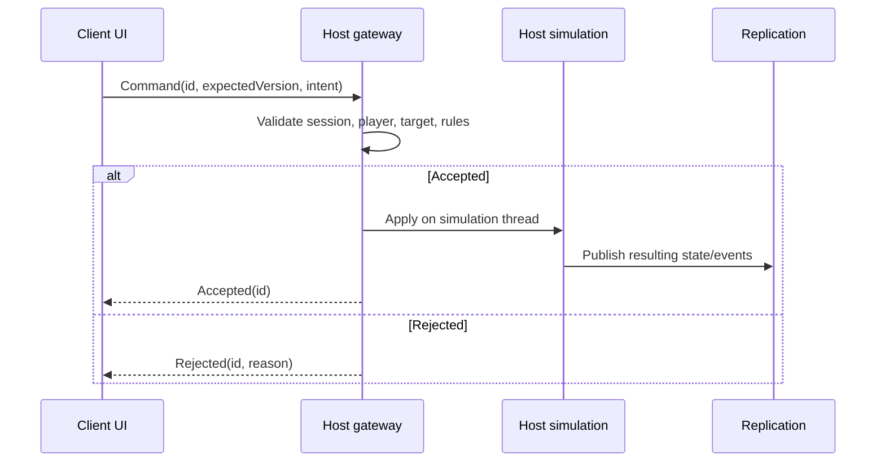
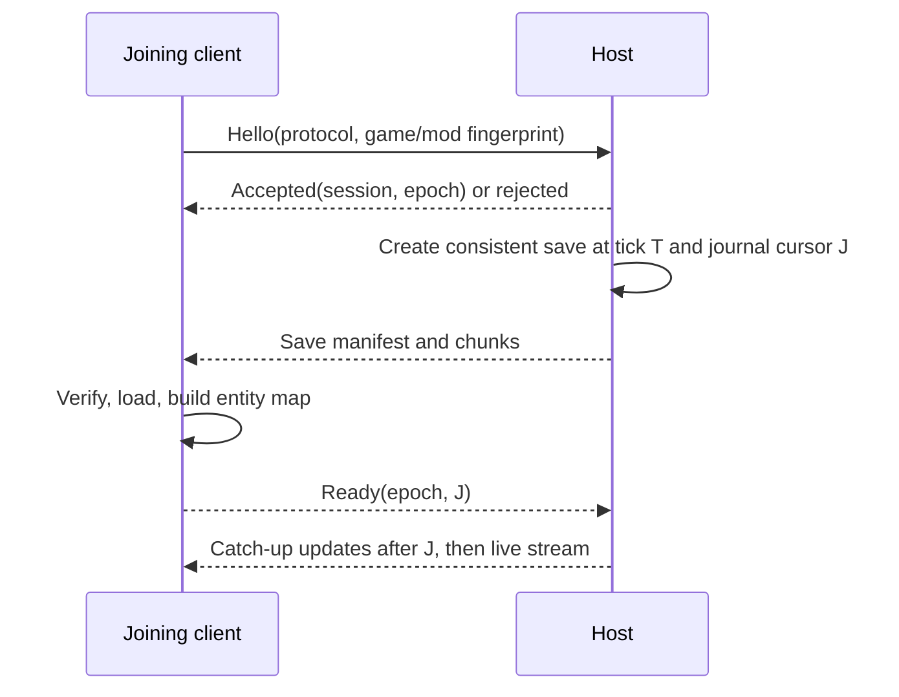

# ONI Together: Full Multiplayer Mod Architecture

**Design proposal · 23 September 2026**  
**Scope:** Whole mod: session lifecycle, simulation authority, player commands, world and entity replication, saves, time control, presentation, transport, recovery, and implementation strategy.  
**Status:** Target design and migration guide. This is not a claim that the current repository already implements these components or that every ONI system can be made passive without investigation.

## 1. Decision and constraints

One host owns the canonical colony. Clients issue player commands and display a local copy. The host's accepted commands, simulation outcomes, and save state are the source of truth. A client can predict harmless UI feedback, but cannot commit world mutations independently.

ONI was designed around a local simulation. A loaded client world may continue running internal systems even if selected chores are disabled. Therefore **host authority is an invariant enforced subsystem by subsystem**, not a switch that makes the entire client passive. Where a client must run an ONI subsystem for rendering or object lifecycle, isolate its side effects and reconcile the resulting state. If a subsystem cannot be isolated cheaply, retain a narrow mirrored behavior with explicit divergence detection until it can be replaced.

### Goals

1. A player can join a running host, issue commands, and see a coherent world.
2. Clients eventually converge to host state even when a transient animation fails or a packet is lost.
3. Reconnect and hard sync establish a clear new baseline without replaying obsolete history.
4. New sync features fit a common ownership, identity, versioning, and logging model.
5. The design can be adopted incrementally in the existing Harmony/OxySync/Riptide-based mod.

### Deliberate limits

- No deterministic lockstep assumption. We do not require every ONI simulation step to yield identical results on different machines.
- No full world save on every tick. Use targeted deltas plus occasional checkpoint/resync.
- No streaming every animation frame. Send semantic activity/events where feasible.
- No client host migration in the first design. A disconnected host ends the session; migration requires a separate authority-transfer protocol.
- No promise that arbitrary third-party mods are compatible. A session advertises and checks a compatibility fingerprint.

## 2. System map



The host may also have a local player. That player's world-changing input uses the same command validation policy, even if it can enter the simulation directly. The host remains authoritative for all players.

| Layer | Host | Client |
| --- | --- | --- |
| Input | Validate and apply commands | Capture input, send requests, show pending UI feedback |
| Simulation | Run authoritative ONI world | Run only the ONI systems required to maintain a usable local world; suppress or correct non-authoritative effects |
| Replication | Emit lifecycle, state, activity, and event updates | Apply ordered updates to mapped objects |
| Persistence | Produce canonical saves/checkpoints | Load transferred baseline; never publish its local save as canonical |
| Presentation | Render normally | Render state and replay selected host events |

## 3. Ownership rules

Every networked feature needs an ownership record before implementation. The default owner is the host. Local camera, menus, hover, and selection are client-owned. Shared UI settings are command-driven only if they affect colony state.

| Domain | Canonical value | Client behavior | Minimum correction |
| --- | --- | --- | --- |
| Grid materials, mass, temperature, disease | Host simulation | Apply region deltas; inhibit competing local mutation where possible | Region version/hash and region refresh |
| Buildings, construction, deconstruction | Host | Send designation commands; apply spawned/despawned objects and state | Entity snapshot and targeted region refresh |
| Duplicants, creatures, chores, AI | Host | Display position/activity; avoid local decisions that mutate canonical state | Entity state snapshot |
| Inventory, storage, equipment | Host | Apply item identity, quantity, ownership, and slots | Inventory/equipment version |
| Power, liquids, gases, heat and other networks | Host | Maintain enough local representation to render; apply outcomes | Network/region snapshots as needed |
| Research, priorities, schedules, policies | Host | Send edit commands; apply accepted values | Domain snapshot |
| Speed, pause, simulation tick | Host | Send desired speed; obey published effective speed | Speed state and tick epoch |
| Camera, cursor, local selection | Each player | Immediate local update | None |
| Reactable/emote/effects | Host event or current activity | Replay presentation without independent gameplay decision | Activity state; one-shot event can expire |

Do not assume a single `IsClient` check makes a subsystem safe. For each patch, state whether it blocks an input, blocks a simulation mutation, observes a host event, applies replicated state, or only controls presentation. An ownership registry in documentation/code review can prevent accidental double writers.

## 4. Protocol model

Messages belong to six conceptual families:

| Family | Direction | Meaning | Typical delivery |
| --- | --- | --- | --- |
| Session control | Both | Hello, compatibility, keepalive, readiness, resync, disconnect | Reliable |
| Command request/result | Client → host → requester | Intent plus acceptance/rejection and reason | Reliable, ordered per player |
| Entity lifecycle | Host → clients | Spawn, bind, reparent, despawn | Reliable, ordered before dependent state |
| Authoritative state | Host → clients | Versioned values, deltas, region refresh | Reliability according to state type; latest-value state may supersede old values |
| Semantic event | Host → clients | One-time outcome or presentation cue | Reliable ordered where causally important; bounded age |
| Snapshot/save | Host → joining or resyncing client | Baseline plus high-water mark | Reliable chunked transfer with integrity checks |

Every gameplay message includes `ProtocolVersion`, `SessionId`, `Epoch`, and an appropriate sequence/version. `Epoch` changes when a new save baseline is installed or a host session starts. A packet from an old epoch cannot modify the current world.

Example envelope (illustrative, not a required C# implementation):

```text
session | epoch | stream | sequence | hostTick | messageType | payloadLength | payload
```

Separate sequence domains by stream if delivery is independent. A global host journal index can establish causality across streams, but a global number alone does not reorder packets on separate channels. For dependent messages, require prerequisites (`entitySpawnVersion`, `baselineVersion`, `stateVersion`) or deliver them in a reliable ordered stream. Define wraparound and version comparison before using fixed-width counters.

### Transport lanes

1. **Control/commands/lifecycle:** reliable ordered, low volume.
2. **Snapshots:** reliable chunked, bounded concurrent transfers, checksum and resume/retry at chunk or whole-transfer level.
3. **State updates:** coalesced by entity/region; reliable where loss cannot be replaced, otherwise periodic refresh repairs loss.
4. **Transient presentation:** delivery and age policy based on whether loss matters. Never let a missed cosmetic event block the authoritative state stream.

Riptide or another transport can implement these policies; these are protocol semantics, not a claim about an existing channel configuration. Enforce message-size limits, bounded receive queues, and per-tick send budgets so a large colony or save transfer does not starve commands.

## 5. Command pipeline

A command is a request to change the world, not evidence that the change already happened.



The host checks session membership, command schema and size, relevant permissions, current target existence, and gameplay preconditions. Execute ONI mutations on the correct game thread, in a defined order. `Accepted` only means the command entered the authoritative flow; the resulting state update confirms what actually changed. Return a clear rejection if a target became stale.

Each client uses a monotonically increasing `ClientCommandId` scoped to its connection/session. The host retains a bounded deduplication record so retries cannot apply the same build, priority, or speed command twice. A reconnect creates a new connection identity or resumes with an explicit last-acknowledged command boundary. Client UI may show a pending designation, then replace or remove it according to host result.

### Command adapters

Use a common command gateway, then domain-specific adapters: dig/build/deconstruct, errands and priorities, schedules and policies, equipment, speed, and any mod-provided commands. Capture at the player-control boundary when possible; do not treat arbitrary ONI internal state changes as player commands. Host-local actions should pass through equivalent validation semantics.

## 6. Simulation time and pause

The host publishes **effective speed** and a host tick/time reference. Clients send an absolute desired speed (`Paused`, `Normal`, `Double`, `Triple`) rather than “toggle” as a network command. A local button may be a toggle, but its handler translates the player's requested target to an absolute value before sending. This avoids pause counters and duplicated toggles producing different results on each machine.

If multiple players can control speed, define one policy: host-only; any player last-writer-wins; or explicit vote/lock. Choose and expose the policy in UI. The default proposal is host-owned speed with configurable permission to request changes; the host publishes the resulting value to all. During save/load/hard sync, the host holds a named pause reason internally but broadcasts a single effective speed state. Clients never independently advance canonical time because their local pause counter differs.

Host tick timestamps help discard stale events and measure drift. They do not by themselves make the client deterministic. Time correction should avoid jumping animation and UI unnecessarily while keeping simulation-owned state current.

## 7. Identity and object lifecycle

Network entity IDs are stable across a baseline save and the deltas that follow it. The host assigns IDs; clients maintain a mapping from host ID to local ONI object. Local Unity instance IDs, object names, and transient hash codes are not network identities.

Define identity for: duplicants, creatures, buildings, stored items/equipment, world regions, and any target referenced by commands or events. An ID must include or be guarded by an epoch/generation to prevent reuse of a destroyed object from binding to a later spawn. Decide how existing objects in a transferred save obtain the same IDs on both machines: persist a mod-owned ID with the save where feasible, or distribute a validated baseline mapping keyed by stable save data. This is a gating design spike, since unreliable baseline mapping breaks all later references.

Lifecycle order is `Spawn/Bind → State → Event → Despawn`. Keep a bounded pending queue for updates received before binding. Tombstone despawned IDs for a short period so late packets cannot resurrect them. Object creation and destruction must suppress echo publication when initiated by replay.

## 8. World and state replication

### State granularity

Use domain-specific state adapters rather than one universal object serializer. Each adapter defines: host capture boundary, payload, version, client apply operation, verification, and snapshot format.

- **Grid and elements:** partition by world and region/chunk. Publish compact changed-cell ranges or region deltas; periodically compare region hashes and request a region refresh. Avoid per-cell network messages.
- **Entities:** lifecycle and versioned components such as position, current world, health/status, equipment, inventory, building configuration, and work progress. A component update replaces older values for that component.
- **Colony settings:** schedules, priorities, policies, research, and other small shared state; apply accepted command results and periodic snapshots.
- **Relationships:** storage item belongs to building, equipment occupies duplicant slot, target/errand references. Apply only after both referenced IDs exist or hold pending with expiry.

The host should emit changes at stable simulation boundaries rather than during partially mutated object state. Coalesce repeated values within a tick. If the client applies deltas to an ONI subsystem that subsequently mutates them, either block the competing path, reconcile at a known cadence, or change the adapter. Avoid fighting the client simulation with high-frequency writes indefinitely.

### Coverage ledger

For each domain record `Authoritative owner`, `Client code still runs`, `Command source`, `Delta`, `Snapshot`, `Verifier`, `Recovery action`, and `Known unsupported cases`. An unlisted domain is not considered synchronized. Start with a small playable coverage set and expand it based on measured divergence.

## 9. Save, join, reconnect, and hard sync

An ONI save is a useful baseline, but it needs a consistent cut with the live replication stream. A naive save transfer followed by arbitrary live messages can lose events or apply them twice.

### Join handshake



The host must define when `T/J` are captured relative to saving and event publication. If saving spans multiple ticks, pause at a safe boundary or use a known consistent save mechanism with a journal that covers the whole interval. Keep a bounded catch-up journal while the client loads. If it overflows, restart with a newer baseline rather than silently skipping updates. Buffer early live messages on the client until world load, mapping, and catch-up are complete. The host should not treat the client as active until it acknowledges readiness.

### Reconnect

If the old baseline and journal cursor are still available, resume with missing updates and verify versions. Otherwise transfer a fresh baseline. Rebind player identity separately from network connection identity. Expire stale commands and transient events. Never apply old-epoch packets after installing a new save.

### Hard sync

Treat hard sync as a session transition with an explicit phase: request → host safe point and pause → save/cursor → transfer/verify → client unload/load and identity rebuild → catch-up → readiness → resume. The host creates one canonical save for the epoch; clients do not each save and package their independent state. A failed client remains out of the live stream and can retry from a fresh baseline. Host simulation may remain paused for a bounded barrier or continue with a catch-up journal; choose deliberately based on measured save/load time and buffer capacity.

Check save size, checksum, compatible game/mod build, and transfer limits before load. Write chunks to a temporary file and atomically promote the verified save. Do not execute content from a peer; deserialize only the expected save/protocol formats through the game's trusted loading path.

## 10. Domain integration contract

Every synchronized ONI subsystem implements the same architectural contract, even though its game-specific adapter differs. A domain can represent grid simulation, buildings, inventories, creatures, colony settings, time control, or presentation. No particular domain defines the architecture for the others.

For each domain, specify all of the following before adding network messages:

| Contract item | Question the adapter must answer |
| --- | --- |
| Authority | Which host operation commits the canonical change? Which local client operations must be blocked or corrected? |
| Input | Which player intent becomes a command, and how does the host validate and acknowledge it? |
| Observation | At what completed host-side boundary is the outcome captured? |
| Representation | Is the outcome a durable state value, an entity lifecycle change, a short-lived event, or a combination? |
| Dependencies | Which entities, regions, and prior versions must exist before apply? |
| Apply | How does the client reproduce the result without publishing it again or making an independent gameplay decision? |
| Baseline | What does a joining client need to reconstruct the domain at snapshot cursor `J`? |
| Verification | What value, version, or hash can be compared after application? |
| Recovery | Can a targeted refresh repair it, or does it require a new save baseline? |

Use **durable state** for facts a joining client must know now, such as material contents, object existence, storage quantity, schedule settings, and current activity. Use **events** for outcomes that happen once, such as a short visual effect or notification. A domain may emit both, but loss of an optional event must not prevent durable state from converging. For long-running behavior, synchronize the current state and transitions rather than relying only on an earlier start event.

Client application runs within a common replay/apply guard to prevent network echo. That guard only marks the immediate call stack; deferred callbacks need explicit attribution if they can produce further mutations. Before invoking an ONI method during apply, inspect its side effects. It may change other domains, schedule future work, or publish hooks. Either route those effects through their authoritative adapters, suppress them on clients, or reconcile them afterward. This rule applies equally to grid updates, building state changes, inventory transfers, AI activity, and animation.

A domain is complete only when its **command, live outcome, baseline, verification, and recovery** paths agree. A feature that appears correct during live play but fails after joining or hard sync is incomplete. The separate animation and reaction design is an example of applying this contract to one domain; it does not change the mod-wide rules here.

## 11. Interest and performance

Track world/region subscriptions for large state domains. A client needs full canonical state at its current baseline, but live detailed updates can prioritize viewed worlds/regions if deferred areas are refreshed before display or interaction. Do not let interest filtering omit a gameplay-critical command result or leave a referenced entity permanently unresolved.

Measure bytes by domain, queued bytes, serialization/apply time, join time, tick delay, pending entity references, region hash mismatches, and resync frequency. Batch/coalesce within a tick; prioritize control and small commands over bulk save chunks. Rate-limit retry loops and diagnostics. Make heavy verification configurable and sample it in normal play.

## 12. Compatibility, trust, and failure boundaries

Exchange protocol version, ONI build, mod build, relevant enabled-mod fingerprint, and save format capability before transfer. Reject incompatible sessions with an actionable reason. Version the payload schema; add optional fields with defaults and explicit feature negotiation. A matching protocol version alone does not prove game state compatibility.

The host validates client requests and never trusts client-provided entity IDs, coordinates, strings, or sizes without bounds and semantic checks. Clients only accept authoritative world updates from the current host and epoch. Network disconnect, malformed message, and replay exception should fail the affected session/update cleanly instead of crashing the process.

Failure policy:

| Failure | Response |
| --- | --- |
| Lost replaceable state update | Newer update or targeted refresh supersedes it |
| Missing lifecycle/dependency | Buffer briefly; request entity snapshot; expire with diagnostic |
| Cosmetic event fails | Log and continue; state applier remains authoritative |
| Region/entity hash mismatch | Targeted resync, then full baseline if persistent |
| Journal gap during join | Abandon partial catch-up and restart baseline |
| Host disconnect | End session; client cannot declare itself new host without a future transfer design |

## 13. Code layout and boundaries

Suggested responsibilities, adaptable to the repository's existing structure:

```text
Shared/Protocol/         envelope, versioned messages, serialization
Networking/Session/      handshake, epochs, readiness, reconnect, transport
Networking/Commands/     gateway, validation, command adapters, acknowledgments
Networking/Identity/     network IDs, binding, lifecycle, pending references
Networking/State/        domain capture, deltas, versions, snapshots, apply
Networking/Events/       host journal, semantic events, replay adapters
Networking/SaveSync/     baseline creation, chunks, verification, catch-up
Networking/Diagnostics/  tracing, metrics, hashes, mismatch reports
Patches/                 thin ONI observation, input capture, apply guards
```

Keep game-specific Harmony patches thin: they call a domain service with validated inputs. The service owns authority checks, protocol construction, and error handling. Do not make the wire schema mirror private ONI constructors or reflection signatures. Put version-dependent ONI calls behind adapters so an update breaks a limited surface.

## 14. Verification strategy

Establish a deterministic *test procedure* even if the simulation itself is not deterministic. For each domain, compare host/client state after a known command and after hard sync. Capture sequence, epoch, tick, entity ID, command ID, and version in paired logs. Maintain small scripted scenarios plus longer soak runs.

Minimum end-to-end scenarios:

1. Empty/new colony join, load, ready barrier, first command, and disconnect.
2. Busy colony late join while host continues changing grid and entities.
3. Duplicate/reordered command and state packets under injected transport faults.
4. Build/dig/deconstruct, item transfer, equipment, chore/animation, and speed control.
5. Save or load failure, journal overflow, reconnect, and hard sync.
6. Multiple worlds and off-screen regions; compare region and entity hashes.
7. Third-party mod mismatch and incompatible game build rejection.

An acceptance criterion for a domain is not merely “it looked right once”: the host and client values match after the action, after a short idle period, and after baseline/reconnect. Cosmetic behavior is checked separately from persistent state.

## 15. Incremental implementation plan

| Phase | Deliverable | Exit evidence |
| --- | --- | --- |
| 0. Inventory | Map current patches/syncers to ownership ledger; measure divergence | A list of synchronized, mirrored, and unsynchronized domains |
| 1. Session foundation | Compatibility handshake, session/epoch, command IDs, logs | Stale packets and duplicate commands are rejected |
| 2. Baseline and identity | Consistent save cursor, entity binding, catch-up, ready barrier | Join and hard sync without missing or duplicate changes |
| 3. Command authority | Common gateway for core input and absolute speed requests | Two clients produce one host outcome per command |
| 4. Core state | Versioned entity components and high-value region deltas | Measured convergence after construction, inventory, and equipment changes |
| 5. Presentation | Semantic events, activity snapshots, replay adapters | Reaction plays when possible and state converges when it does not |
| 6. Recovery and scale | Targeted refresh, hashes, subscriptions, budgets | Long soak and late join within measured resource limits |

Do not begin by rewriting all existing synchronization. Wrap current behavior in the session, identity, and ownership contracts first; replace a domain when its capture/apply and recovery path can be verified. The oxygen-mask Reactable issue is a useful vertical slice because it crosses host decision, entity/target mapping, one-shot presentation, equipment state, and resync.

## 16. Decisions still requiring repository and game-code inspection

These are explicit design spikes, not implementation facts:

1. Which ONI save API produces a consistent cut, and whether simulation must pause during capture.
2. Whether mod-owned entity IDs survive save/load or require a baseline mapping; how item and nested object identity works.
3. Which client simulation systems can be suppressed without breaking visuals, lifecycle, or save loading.
4. Which existing syncers already own state and which accidentally echo client mutations.
5. Which Riptide delivery modes and payload sizes the current mod actually uses.
6. Whether host callbacks expose stable semantic points for grid, inventory, chores, and activity transitions.
7. The safest Reactable replay entry points, especially where `Run` mutates equipment.
8. The actual byte rate and CPU cost of grid/region changes in representative colonies.

These spikes determine adapter details and batching thresholds. They do not change the central rule: **commands enter the host; host state and outcomes flow outward; saves establish baselines; clients render and reconcile against the host.**
