# ONI Together: Host-Authoritative Animation and Reaction Architecture

**Design note — 23 September 2026; architecture updated — 3 October 2026**  
**Status:** Enduring host-authoritative presentation architecture with current integrated design boundaries and proposed migration components clearly separated.

## Architecture and implementation boundary

This document defines the enduring animation, navigation, worker-presentation, and reaction architecture. It may describe integrated subsystem behavior where that behavior establishes an ownership or lifecycle boundary, but it is not a release-status or test-history document.

Keep these categories separate:

- **Architecture:** enduring ownership, lifecycle, ordering, replay, identity, and recovery rules.
- **Integrated design:** architecture already represented in the mod and expected to remain part of the design.
- **Proposed migration:** broader semantic-event, snapshot, and adapter mechanisms that are not yet fully implemented.

Detailed bugs, runtime counts, temporary regressions, release blockers, and exact-release verification belong in `STATUS.md` and `DEVELOPMENT_ROADMAP.md`.

## Goal

The host runs the authoritative Oxygen Not Included simulation. A client sends player commands, applies host-owned state, and reproduces selected presentation events. The client should not independently decide whether a host-initiated reaction was eligible according to its own chore scheduler, especially where client chores are intentionally disabled.

Separate three kinds of information:

| Kind | Examples | Owner and delivery | Recovery |
| --- | --- | --- | --- |
| Persistent simulation state | Position, equipment, inventory, health, building state | Host publishes state deltas and snapshots | Reconcile from a snapshot |
| Transient events | Reaction start, emote, effect, sound cue | Host publishes ordered, short-lived events | Drop stale events; current state remains correct |
| Persistent presentation state | Walking, working, sleeping, current target | Host publishes changes and includes the current value in snapshots | Restore current activity on join/resync |

Camera, cursor, hover, selection, and most UI behavior remain local. Player input that changes the world is a *command request* to the host; a reaction that already occurred is an *event* from the host.

## Main data flow

```mermaid
flowchart TD
    I[Client command] --> H[Host validates and simulates]
    H --> S[Authoritative state stream]
    H --> E[Presentation event stream]
    S --> A[Client state applier]
    E --> R[Client event replayer]
    A --> W[Client ONI world]
    R --> W
```



Harmony hooks on the host should observe stable semantic boundaries and delegate to replication services. Receive handlers on the client should resolve network entities and delegate to replay adapters. Keep serialization, network ordering, and game-specific behavior outside the Harmony patch body.

## Integrated architecture mapping

| Domain | Integrated design | Architectural boundary |
| --- | --- | --- |
| Navigation | `NavigatorSyncer` publishes sequenced host-selected transitions. Successful arrival is published before vanilla arrival callbacks can synchronously start work; nested cleanup for the same arrival is not treated as a second independent arrival event. | Navigation owns locomotion/arrival semantics. Arrival ordering must not overwrite worker ownership. |
| Ordinary work | `StandardWorkerSyncer` publishes ordinary worker start, completion, abort, and tool-target presentation through the synchronized lifecycle. | Ordinary `StandardWorker` behavior is one domain. Special workables must be analyzed through their own lifecycle instead of inheriting ordinary-work assumptions. |
| Special workables | Work families such as `Pickupable`, edible work, dehydrated-food rehydration, and other non-equivalent workables are excluded from the ordinary StandardWorker contract where their lifecycle differs. | Exclusion from one syncer does not make another replay path automatically safe. Each special family requires a coherent domain contract across start, presentation, completion, state mutation, and recovery. |
| Animation and symbols | `AnimSyncer` publishes animation play, KAnim overrides, and symbol-visibility operations with replay/echo suppression. | Synchronize semantic animation operations rather than streaming frames. Operations that may occur before entity registration need an explicit convergence/baseline rule. |
| Reactables | Host authorization with client-local execution is the integrated rule. The host owns whether the reaction is allowed; the client uses its locally initialized Reactable and local safety checks. | Authorization is not permanent gameplay authority. Identity, expiry, ordering, duplicate handling, and late-join state must remain explicit. |
| Game speed | `GameSpeedSyncer` follows client request → host validation/application → revisioned client application. | Speed/pause is host-owned simulation state, not independent local presentation. |

## Navigation and work lifecycle

Navigation and work are separate ordered lifecycles that meet at arrival. The host publishes a successful arrival before vanilla arrival processing can synchronously call `StartWork`. While that outer arrival `Stop` remains on the stack, the syncer marks an arrival scope and suppresses the nested non-arrival cleanup `Stop`; otherwise clients could observe stop/work ordering that never represented the host's semantic sequence.

`StandardWorkerSyncer` owns ordinary `StandardWorker` presentation and work lifecycle. It deliberately excludes work families whose start/complete semantics are not equivalent to ordinary work. `Pickupable`, edible work, dehydrated-food rehydration, and similar special families therefore require their own synchronization contracts. Exclusion from the StandardWorker path is only an ownership boundary; other replay systems must still respect the special family's lifecycle and side effects.

Navigation animations, working animations, and tool-target presentation must not overwrite each other merely because callbacks interleave. A local guard is acceptable for synchronous replay suppression, but durable ordering must come from the semantic lifecycle and transport/sequence policy.

## Reactions and animation: current and target boundaries

The current Reactable decision is **host authorization with client-local execution**, not direct remote construction and not yet the generic semantic-event architecture described below. The host runs vanilla eligibility, publishes an authorization after `CanBegin` succeeds, and the client allows only a locally discovered Reactable whose id and reactor identity match a consumable authorization. Local `InternalCanBegin` remains as runtime-safety validation; it is not the gameplay-authority decision.

This authorization design is provisional but intentional. Do not replace it merely to make the implementation resemble the broader target model. Expiring authorizations, stronger context keys, bounded pending authorization, duplicate diagnostics, persistent activity snapshots, and family-specific adapters are possible improvements that require evidence and an explicit architecture decision.

### Proposed semantic-event direction

As a broader target, the host can publish semantic presentation events once a reaction begins. A client event adapter would resolve the relevant duplicant, Reactable, and target; check identity and freshness; and reproduce presentation without re-running host gameplay authority. This is proposed evolution, not a description of the current authorization RPC.

An illustrative wire message:

```csharp
public readonly record struct ReactionStarted(
    ulong Sequence,
    long SimulationTick,
    ulong ReactorEntityId,
    string ReactionKind,
    ulong? TargetEntityId,
    string? Variant);
```

`ReactionKind` is a stable protocol meaning such as `equipment/equip`, `equipment/unequip`, or `emote/wet-feet`. A local adapter maps that meaning to the ONI implementation. Exact runtime class names and constructor details can be diagnostic metadata or a temporary compatibility path, but should not define the long-term protocol. The message fields above are illustrative; the actual schema needs to follow what each adapter requires.

Do not stream individual animation frames or every internal state transition. A start event normally allows ONI to play its own sequence. Long-lived activities need a state update (and, if necessary, a stop/transition), since a start event alone cannot restore them after late join or resync.

### Replay context

Use one narrowly scoped, nest-safe context to mark synchronous application of a remote event. This lets patches distinguish replay calls from locally initiated simulation and avoid echoing the same event back over the network. It is an execution marker, **not** a new authorization protocol.

```csharp
using (NetworkReplayContext.Enter())
{
    adapter.Replay(message);
}
```

The implementation should restore its previous depth in `Dispose` even when replay throws. A thread-local depth is suitable only for synchronous calls on the same thread. Do not assume it remains active for later coroutine, state-machine, or animation callbacks; use an explicit per-entity presentation state or another durable marker if those later callbacks need attribution.

Client replay still validates object existence, identity, freshness, duplicates, and compatibility. It does not repeat host-only chore eligibility. Some Reactables mutate simulation state in `Begin`, `Run`, or `End`, so blindly invoking those methods on a client is unsafe. Each adapter must determine whether ONI's normal method can be used without a second state mutation; otherwise it should reproduce only the presentation and let state replication handle the result.

### Equipment example

For an oxygen-mask station, publish the reaction start as a presentation event and the changed equipment slot as authoritative state. The client may play equip or unequip animation through an adapter, while the state applier sets the equipment to the host's value. If presentation replay fails, state convergence still succeeds. If a late joiner loads after the reaction, it receives the current equipment and activity without replaying an old equip animation.

This does **not** imply that equipment mutation is always a single independent packet: the protocol must establish ordering or a version boundary so a late or duplicate animation event cannot undo newer equipment state.

## Entity identity and event transport

Use host-authoritative durable network entity IDs, or an equivalent host-controlled baseline mapping, and maintain a host-identity-to-local-object registry on each client. Never use Unity's local instance ID as a cross-machine identifier. Reactions, targets, buildings, equipment, and state changes all refer to these IDs.

Host events carry a monotonically increasing sequence and a simulation tick. Establish ordering at least for dependent events on an entity; a global sequence can simplify diagnosis, but it alone does not make independent transport channels ordered. Use a reliable ordered channel for events whose ordering matters, or buffer/reorder them explicitly. Apply state versions so an older delta cannot overwrite newer state.

Track recently applied event IDs to suppress duplicates. If an event references an entity that has not spawned or finished loading, queue it briefly with bounded size and expiry. Do not replay a transient animation after it is stale. A missing or expired presentation event should never block state updates.

## Snapshots, resync, and failure handling

Snapshots contain authoritative persistent state and the current presentation activity; they do not contain historical one-shot animation events. On join or hard sync, load the save/world, establish an agreed snapshot version, resolve the entity registry, then process newer events and deltas. Buffer incoming updates across this boundary and discard those already represented by the snapshot.

Reconciliation repairs simulation state. It will not recreate every transient visual moment, which is acceptable. Log replay failures with sequence, tick, entity, reaction kind, and exception; keep processing the network stream. If an adapter or referenced ONI method can alter simulation state, isolate that risk before enabling it on clients.

## Proposed target components

| Component | Responsibility |
| --- | --- |
| `NetworkEntityRegistry` | Map stable host IDs to local ONI objects and track lifecycle |
| `CommandRouter` | Send client requests to the host and validate them there |
| `StateReplicator` / `StateApplier` | Publish host state versions and reconcile client state |
| `PresentationEventPublisher` | Observe host semantic events after they occur |
| `EventDispatcher` | Order, deduplicate, queue, expire, and route incoming events |
| `IReactionReplayAdapter` | Reproduce a reaction safely for a specific semantic kind |
| `NetworkReplayContext` | Mark synchronous replay and prevent echo loops |
| `SnapshotCoordinator` | Establish save/snapshot/event handoff on join and resync |

An adapter registry can begin with a generic path for safe Reactables and add focused adapters for equip/unequip, social reactions, and self emotes as their lifecycles demand. Avoid building a special adapter for every subclass before measuring which cases need one.

## Incremental migration from the current implementation

1. Preserve the established Navigator arrival-ordering and ordinary StandardWorker ownership boundaries while extending coverage to additional interruption and special-workable lifecycles.
2. Give each special workable family a coherent domain contract covering authoritative start, presentation, completion/abort, state mutation, join/resync state, and recovery.
3. Preserve semantic `AnimSyncer` operations and define how operations that occur before local entity/behaviour registration converge through baseline state, deferred application, or local reconstruction.
4. Keep the Reactable host-authorization/client-local execution rule unless evidence supports a deliberate architectural change.
5. Strengthen Reactable authorization with expiry, session/generation context, duplicate diagnostics, and bounded pending behavior where needed.
6. Separate persistent simulation outcomes such as equipment state from transient reaction presentation, so failure of one path cannot invalidate the other.
7. Introduce common semantic presentation events and replay adapters incrementally for reaction families that benefit from them rather than replacing working specialized synchronization wholesale.
8. Include persistent presentation activity in snapshot/resync state and define the handoff between baseline state and newer transient events.

A representative vertical-slice validation case is equipment interaction such as oxygen-mask equip/unequip because it crosses host authorization, target identity, transient presentation, persistent equipment state, and late-join/resync behavior. This is an architectural validation example, not a release gate.

## Design constraints and open questions

- ONI's full simulation may be difficult to make passive on a client. This is a target ownership model; implementation will require selective suppression and reconciliation rather than assuming all local systems can simply be turned off.
- Whether `InternalCanBegin` is the correct retained local safety check for every Reactable family remains unverified.
- Reactable authorization needs an explicit expiry policy and a robust rule for cases where the relevant network identity is not yet ready.
- A scoped replay flag does not solve asynchronous animation continuation by itself.
- Decide which events require reliable ordering, how state versions interact with them, and whether clocks/ticks permit skipping stale presentation cleanly.
- Confirm how equipment instances and targets are identified across a loaded save, reconnect, and newly spawned objects.
- Define the baseline/recovery semantics for navigation activity, worker presentation, and symbol visibility so late registration, join, and hard sync do not depend on replaying obsolete transient history.

**Core rule:** The host decides what happened; clients render it and converge to host-owned state. A visual replay failure must not become a persistent world-state divergence.
